# FactoriaF5
Primer Proyecto del Bootcamp FemCoders Factoria F5 de maquetación

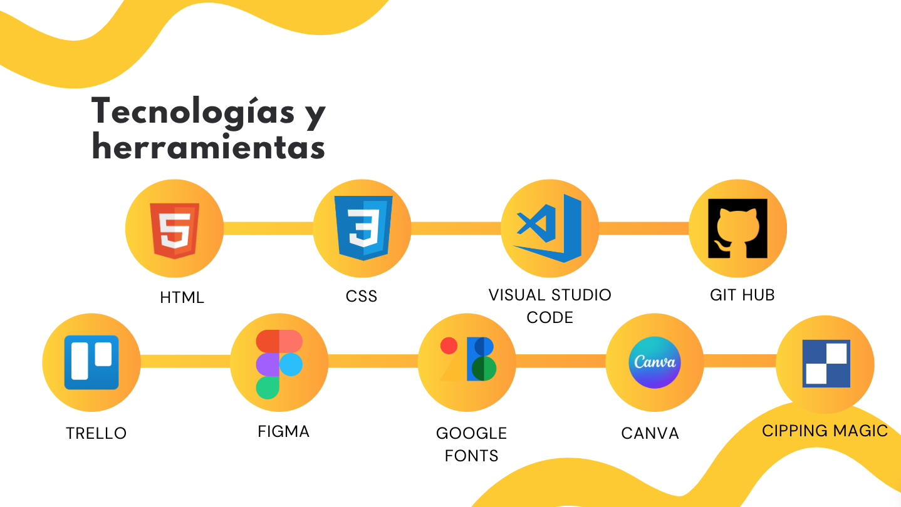

Proyecto de Página Estática realizado por Yana, Rosa, Valentina, Manuela y Mónica

## Figma Atomic Desing
### WireFrame

#### Version Desktop 
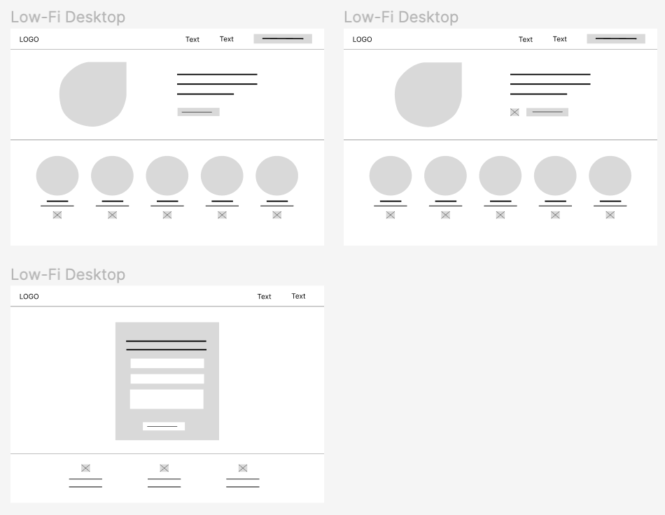
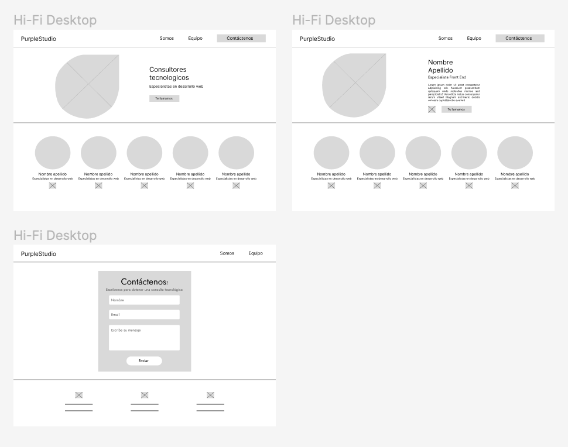
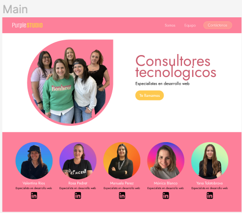
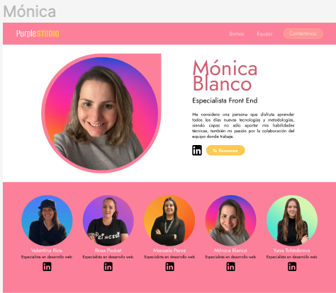

#### Version Tablet
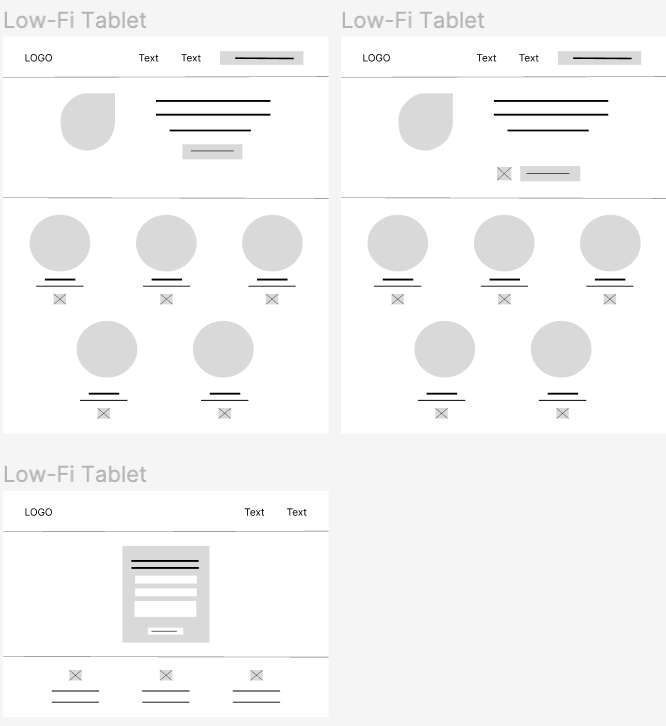
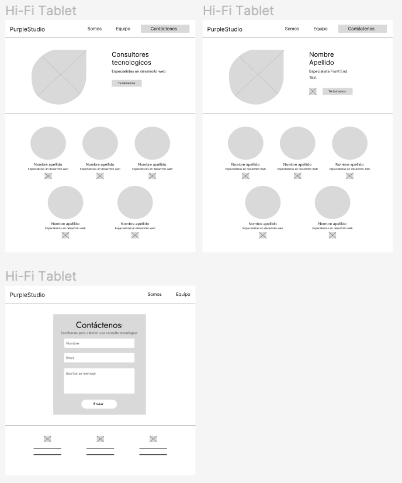
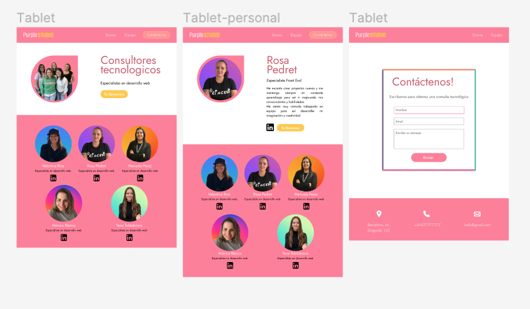

#### Version Mobile
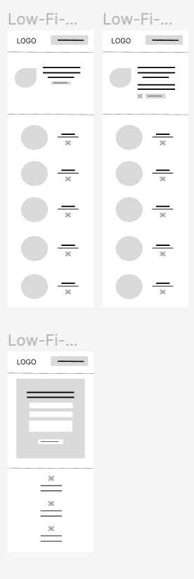
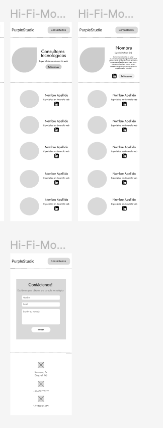
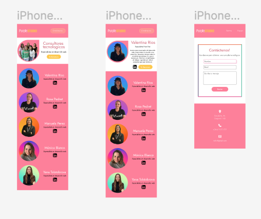

### Version Final en Navegador
#### Desktop
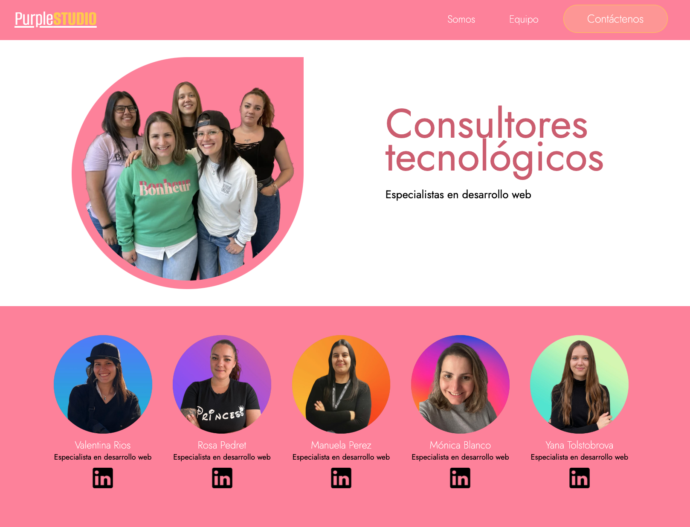
#### Tablet
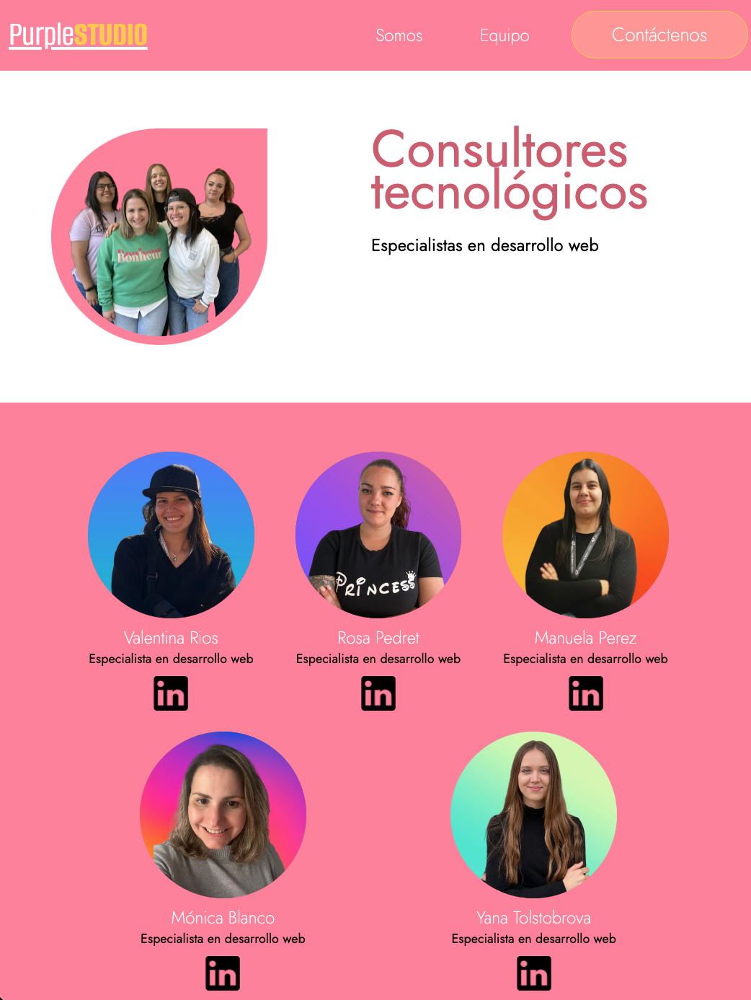
#### Mobil
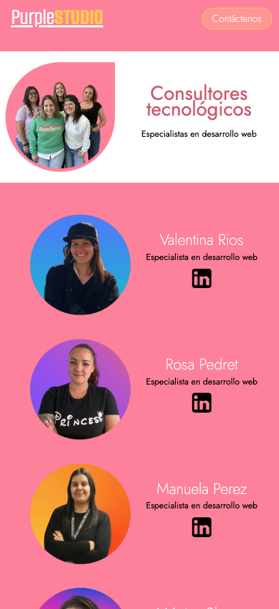

